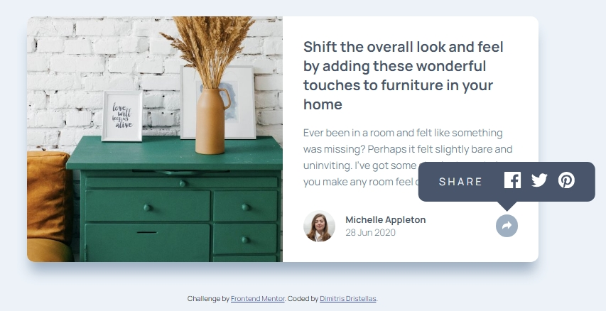

# Frontend Mentor - Article preview component solution

This is a solution to the [Article preview component challenge on Frontend Mentor](https://www.frontendmentor.io/challenges/article-preview-component-dYBN_pYFT). Frontend Mentor challenges help you improve your coding skills by building realistic projects. 

## Table of contents

- [Overview](#overview)
  - [The challenge](#the-challenge)
  - [Screenshot](#screenshot)
  - [Links](#links)
- [My process](#my-process)
  - [Built with](#built-with)
  - [Useful resources](#useful-resources)
- [Author](#author)

**Note: Delete this note and update the table of contents based on what sections you keep.**

## Overview

### The challenge

Users should be able to:

- View the optimal layout for the component depending on their device's screen size
- See the social media share links when they click the share icon

### Screenshot




### Links

- Solution URL: [Add solution URL here](https://github.com/dimitrisdr/preview-component.git)
- Live Site URL: [Add live site URL here](https://dimitrisdr.github.io/preview-component/)

## My process

### Built with

- Semantic HTML5 markup
- CSS custom properties
- Flexbox
- CSS Grid
- Mobile-first workflow


```js
function putSharecontainerToProperParent(){
    if (window.innerWidth >= 1000) {
        if (authorInfoContainer.contains(shareContainer)){
            btnContainer.appendChild(shareContainer)
        }
    }else {
        if(btnContainer.contains(shareContainer)){
            authorInfoContainer.appendChild(shareContainer)
        }
    }
}

window.addEventListener('resize', ()=> {
    putSharecontainerToProperParent()
})
```


## Author

- Website - [Add your name here](https://www.your-site.com)
- Frontend Mentor - [@dimitrisdr](https://www.frontendmentor.io/profile/dimitrisdr)


